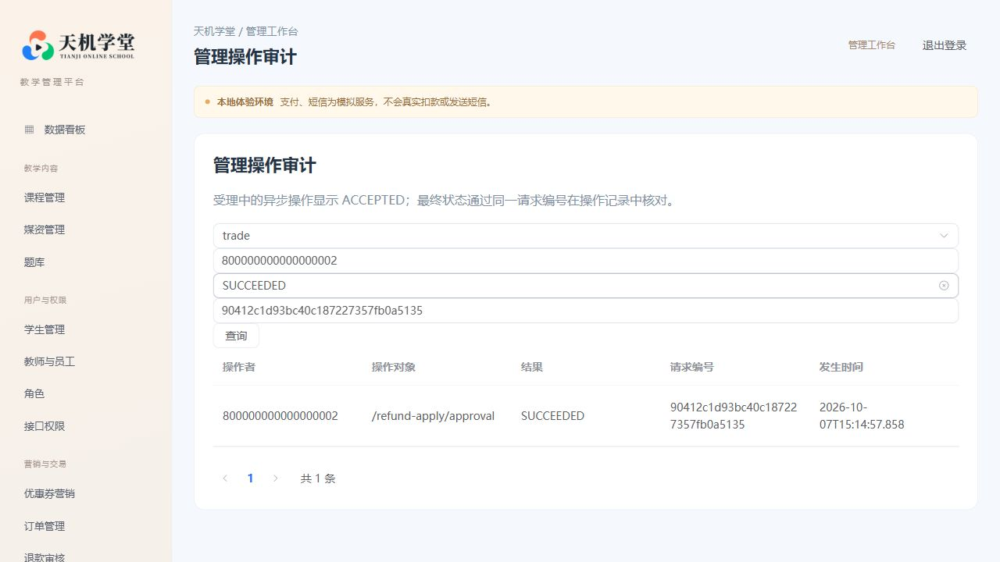

# 合并后的最终部署与实际页面验收

2026-10-07，本机个人演示环境最终保留 `tianji-compact`，4 个业务应用、1 个网关、2 个网页、4 个基础设施，共 11 个容器，全部健康。学生入口为 `http://127.0.0.1:24500`，管理/教师入口为 `http://127.0.0.1:24501`。

## 容器退役与恢复数据

清理范围通过 Compose 项目标签和容器 ID 显式核对：旧 `tianji-final` 的 22 个容器、成功恢复演练的 11 个容器、失败恢复尝试的 1 个容器、Redis 演练的 2 个容器，合计 36 个。只执行停止和 `docker rm`，不带 `-v`，不执行全局 prune。14 个相关卷在清理后逐一确认仍存在；镜像、配置和对象目录保留。其他项目不在命令目标中。

退役前再次停写并校验两份完整备份：

| 来源 | UTC 恢复点 | 数据库 / 表 | 实际媒资文件 |
| --- | --- | --- | ---: |
| 旧历史部署 | 20261007T081829.506503Z | 12 / 168 | 27 |
| 合并演示部署 | 20261007T081738.320207Z | 12 / 182 | 19 |

两份恢复点包含 SQL/触发器、私有配置和签名密钥、实际文件字节、Redis 数据和到期时间、RabbitMQ 数据目录、表行数及 SHA-256；发布前校验文件和压缩包。旧源的运行账号和业务记录仅存入本机忽略目录。完整容器配置、镜像 ID 和卷清单亦保存在忽略目录，不能上传原始 inspect 内容。

当前运行库使用合成演示数据，**旧历史数据没有迁入合并库**。退役容器不会删除旧运行卷；重新访问原业务数据需要安排独立恢复或兼容迁移。旧入口已停用，不能将此次容器清理理解为历史数据切换验收。

## 实际页面与业务结果

使用仓库 Playwright 测试操作实际容器网页，清理前完整回归通过后，再在只保留最终容器的环境执行完整回归。最终为 **25 项通过、0 失败、13 项预期跳过**。跳过项源于同一测试集分别运行学生和管理项目时的适用范围，不是失败后跳过。

- 完整业务：管理端录制并上传真实 WebM 字节、发布试卷；学生选购、创建订单、模拟支付、取得权益、实际视频播放及进度、保存笔记、问答点赞；跨设备草稿冲突及备份、提交考试、教师评分、学习完成；申请退款、管理员审批、订单退款终态、收费视频权益收回和笔记保留。
- 新增教师检查：课程与错误学生组合返回空列表；正确课程与学生组合返回当前答卷；分页从第 1 页开始，授权教师完成评分。教师页面不能暴露管理员操作。
- 新增审计检查：退款审批之后通过页面按 trade 模块、管理员、SUCCEEDED 筛选持久记录，再按请求编号缩小结果。表内操作者、结果和请求编号与筛选值一致；另用数据库检查发布、评分、退款操作与异步终态关联。
- 两端页面：资源列表、实际数据看板、学习和账号页面、收藏、登录过期及刷新恢复、课程配置与 PNG/JPEG 封面、持久草稿与关联回显、1440/845/390 像素布局及空状态。
- 补充手动浏览器检查：学生私人笔记查询；管理审计按模块、操作者、结果、请求编号查询，显示退款审批成功记录。

浏览器测试以页面动作完成业务，使用实际 HTTP 查询辅助确认异步完成、支付幂等和权限拒绝；媒资关联及合成课程通过专用夹具准备。没有调用真实支付商或发送短信。它不代表每个后台 CRUD 组合或生产环境均通过验收。

本轮首次回归在订单创建结果的 5 秒显示等待上超时，当时页面仍在处理中，旧 Java 服务在同一窗口备份后重启；停下旧实例后该步骤通过。资源竞争是可能解释，没有证明它是唯一原因。随后补测发现 Element Plus 下拉框内部输入层遮挡测试点击，改为点击实际可见的选择框容器；手动查询及修正后的完整回归通过。没有以跳过用例或重试次数掩盖失败。

## 验证范围和交付

本轮前端类型检查、双端生产构建、Python 编译、接口权限覆盖及 `git diff --check` 通过。后端代码在此页面清理阶段没有再次修改；同日实现阶段选定的 25 个测试类共 67 项通过，本地模块调用 3 项通过、安全 24 项断言通过、非空 Redis 恢复 9 项检查通过，范围见 [实现报告](compact-implementation-20261007.md)。独立恢复演练核对了 12 库、182 表、13 个媒资文件及恢复前业务历史，并在恢复副本通过完整浏览器路径；这不同于上表后来生成的新备份，未再次对这两份新备份执行完整恢复。

脱敏结果见 [validation.json](evidence/2026-10-07/compact-final/validation.json)。公开结果和截图不包含密码、令牌、签名材料、SQL 数据、私有配置或浏览器 trace。README 已改为最终 11 容器入口、源码启动、页面验收与恢复命令；旧部署手册标注为历史配置。GitHub Actions 的结果以对应提交运行记录为准。

正式的合并前后 12 小时以上容量对照、内存降低至少 20%、原历史业务迁移及换机器恢复仍未验收。历史切换门禁继续拒绝缺少这些证据的切换，不手工填写成功绕过门禁。
