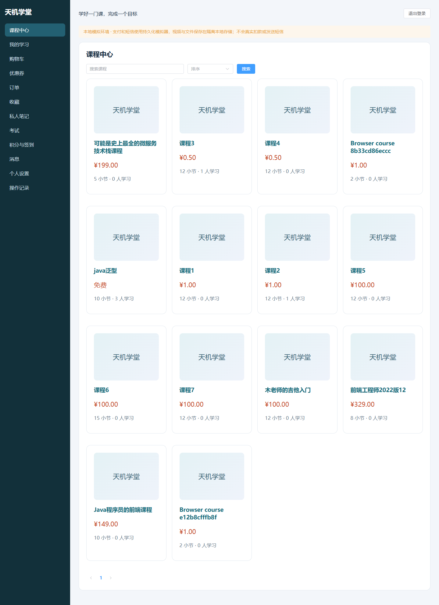
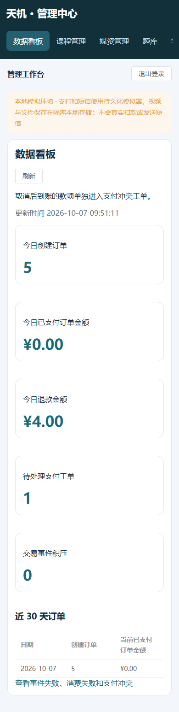

# 天机学堂最终 Compose 部署验收（2026-10-07）

天机项目现在只运行 **tianji-final** 一套 Compose 分组。Docker Desktop 可以展开这一组查看各服务；22 个服务各自使用独立镜像和容器。14 个 tj 后端、学生端和管理端，以及 MySQL、Redis、RabbitMQ、Elasticsearch、Prometheus、Grafana 均已运行且健康。未采用多进程塞入单个镜像的部署方式。

学生端：[http://localhost/](http://localhost/)；管理端：[http://localhost:81/](http://localhost:81/)。本机验证账号在 deploy/final/.local/accounts.json；原业务账号数据保留。部署与恢复命令见 [部署说明](../deploy/final/README.md)。

## 本轮验证

| 验证 | 结果及范围 |
|---|---|
| 整套 Compose 启动 | 22/22 服务健康；后端验证业务就绪，两端页面验证网关可达，监控服务验证就绪接口 |
| 接口业务 | 登录、身份伪造拦截、所有权、笔记幂等与版本冲突、收藏、签到、辅助功能、12 个管理资源接口通过 |
| 支付与退款 | 同请求返回同订单；20 次支付确认只生成一份支付事实及事件；按条目发课、退款撤销相应权益；取消后支付进入人工工单；两条目退款与 20 次重复审批正确汇总终态 |
| 并发与投影 | 6 组支付/取消竞争，以及 100 次点赞、取消点赞竞争、重复和乱序消息投影通过；搜索与权限快照发布通过 |
| 浏览器完整路径 | 11 项通过，7 项按学生端/管理端分工跳过；实际视频上传、购买、播放、笔记、讨论、考试提交、教师评分、学习完成、退款与权限检查通过 |
| 桌面与手机体验 | 1440/390 像素宽度下，两端布局、导航和刷新复测 4 项通过；截图已人工检查 |
| 迁移审计 | 原始 58 张表恢复数量一致；68 条版本化迁移已登记；迁移后学习、收藏、点赞、考试、优惠券和权益关系核对通过；索引 EXPLAIN 证据保存在本机 |
| 监控 | 13 个受保护的应用指标接口、Prometheus 采集目标、Grafana 就绪均通过，整套重启后再次验证通过 |
| 异常退出恢复 | 强制结束学习容器，约 15.52 秒恢复；14 张关键表数量和 4 个上传文件哈希一致 |
| 整套重启恢复 | 约 90.36 秒恢复；14 张关键表数量和文件哈希一致；再次确认 2 个已完成小节、课表完成数、20 分及格考试结果和私人笔记保留 |

异常退出与重启耗时仅是本机一次验证记录，不代表可用性 SLA。本轮没有进行持续压测，不据此给出生产 QPS 或多节点高可用结论。未修改 Java 源码，后端沿用前轮 49 项 Maven 测试及 Linux 镜像核验通过的工件；本轮新增证据来自完整 Compose、真实数据库/缓存/MQ 和浏览器集成。

## 修复的实际问题

课程列表原来引用了接口中不存在的 sectionNum/free 字段，造成小节数缺失及免费显示错误；现已使用生成接口类型、sections 和实际价格，并提供封面失败占位及延迟加载。

模拟支付实现虽可处理支付请求，但渠道表缺少 mockPay 记录，页面显示“支付渠道未配置”。新增 V005 版本化迁移补齐引用记录，渠道接口仍按已配置的支付实现过滤；真实环境不会因此自动启用模拟支付。

管理看板原始 ISO 日期在手机上多行折断，现按业务时区显示紧凑日期和时间。页面明确显示本地模拟环境。笔记验证使用独立课程和学习记录，避免退款测试改变它的学习权限；消息队列验证脚本支持不同环境的用户名。首次失败及修复后重测范围已如实记录。

## 清理与恢复

已删除 28 个旧版和临时容器，包括旧 tianji-desktop、vocational-acceptance，以及单容器实验；其他项目未操作。删除容器没有删除任何恢复数据卷或镜像。旧 SQL、Redis 和 RabbitMQ 备份，以及新版验证后的 12 个业务数据库 SQL、私有配置和密钥备份均保留在本机 Git 忽略目录中。

原 Redis 签到/点赞事实已迁入数据库，未补发历史积分。原错误队列共 10 条消息已归档，没有自动重放；一个无法对应到原问答的点赞键也已归档。它们应在明确原业务事实后单独处理。

应用堆上限 384 MiB、容器上限 768 MiB；数据库连接池每服务最多 8 个连接；MySQL 缓冲池 256 MiB；Redis 上限 96 MiB；ES 堆 512 MiB、容器上限 1536 MiB。构建后的闲置 Linux 文件缓存进行了单次回收，缓存约 4126 MiB 降至 730 MiB，Linux 使用内存约 7205 MiB、交换空间使用为 0。Windows VmmemWSL 工作集不会必然同步立即下降；服务分组本身也不会消除各进程的内存需求。

支付、短信、文件和视频为明确隔离的本地模拟接入；视频读写实际本地文件。真实支付/短信、云媒资和多节点基础设施仍需独立环境验证。Nacos/XXL-Job 在本地配置中关闭，配置、服务地址和持久后台任务由新版应用处理。

完整脱敏运行证据见 [final-deployment.json](evidence/2026-10-07/final-deployment.json)。私有诊断、SQL、真实账号密码、JWT 和请求追踪未提交。

学生端桌面截图：

管理端手机截图：

